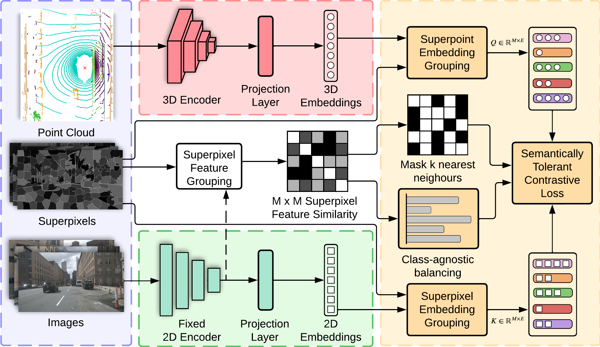

# ST-SLidR

`ST-SLidR` is a 2D to 3D distillation framework for autonomous driving scenes. This repository is based off of [`[SLidR]`](https://github.com/valeoai/SLidR).

**Self-Supervised Image-to-Point Distillation via Semantically Tolerant Contrastive Loss**\
*Anas Mahmoud, Jordan Hu, Tianshu Kuai, Ali Harakeh,  Liam Paull,  Steven Waslander*\
**[[Paper](https://openaccess.thecvf.com/content/CVPR2023/papers/Mahmoud_Self-Supervised_Image-to-Point_Distillation_via_Semantically_Tolerant_Contrastive_Loss_CVPR_2023_paper.pdf)]**



## Installation
Please refer to [INSTALL.md](docs/INSTALL.md) for the installation of `ST-SLidR`.


## Results

All results are obtained by pre-training on nuScenes dataset. Each pretraining experiment is conducted 3 times, and the average performance is reported on Linear Probing using 100% of the labelled point cloud data and on finetuning using 1% of the labelled point cloud data. 

Method                                           |Self-supervised<br />Encoder|Linear Probing<br />(100%)|Finetuning<br />(1%)
---                                              |:-:                 |:-:                       |:-:                                  
[SLidR](config/pretrain/nuscenes/slidr/slidr_moco.yaml)               |[MoCoV2](https://arxiv.org/abs/2003.04297)     |38.08                     |40.01                              
[ST-SLidR](config/pretrain/nuscenes/slidr/stslidr_classbalance_moco.yaml) |[MoCoV2](https://arxiv.org/abs/2003.04297) |**40.56**                     |**41.13**
[SLidR](config/pretrain/nuscenes/slidr/slidr_swav.yaml)               |[SwAV](https://arxiv.org/abs/2006.09882)     |38.96                     | 40.01                             
[ST-SLidR](config/pretrain/nuscenes/slidr/stslidr_classbalance_swav.yaml) |[SwAV](https://arxiv.org/abs/2006.09882) |**40.36**                     |**41.20**
[SLidR](config/pretrain/nuscenes/slidr/slidr_dino.yaml)               |[DINO](https://arxiv.org/abs/2104.14294)     |38.29                    | 39.86                             
[ST-SLidR](config/pretrain/nuscenes/slidr/stslidr_classbalance_dino.yaml) |[DINO](https://arxiv.org/abs/2104.14294) |**40.36**                     |**41.07**
[SLidR](config/pretrain/nuscenes/slidr/slidr_obow.yaml)               |[oBoW](https://arxiv.org/abs/2012.11552)     |37.41                    | 39.51                           
[ST-SLidR](config/pretrain/nuscenes/slidr/stslidr_classbalance_obow.yaml) |[oBoW](https://arxiv.org/abs/2012.11552) |**40.00**                     |**40.87**

## Citation
If you use ST-SLidR in your research, please consider citing:
```
@inproceedings{ST-SLidR,
   title = {Self-Supervised Image-to-Point Distillation via Semantically Tolerant Contrastive Loss},
   author = {Anas Mahmoud and Jordan Hu and Tianshu Kuai and Ali Harakeh and  Liam Paull and  Steven Waslander},
   journal = {Proceedings of the IEEE/CVF Conference on Computer Vision and Pattern Recognition (CVPR)},
   year = {2023}
}
```

## License
`ST-SLidR` is released under the [Apache 2.0 license](./LICENSE). 